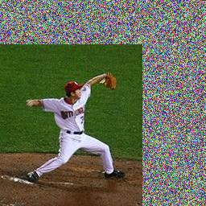
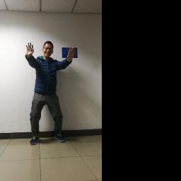

# Pose-Estimation
## 模型选择

　　通过查找相关论文以及讨论之后我们一致决定采用Stacked Hourgalss模型，主要原因在于：
  
　　1）该模型效果好，截至2016年5月，在MPII姿态分析竞赛中暂列榜首。并且此后的很多取得好成绩的模型都是基于该模型。
  
　　2）该模型思路更明晰，网络简洁，网络结构灵活，易于扩展。

### 寻找数据集

　　（1）LSP
  
　　最开始找的数据集为LSP，其数据集存在一个重要的问题：图片的尺寸不一，因此需要将图像的尺寸归一化，统一做成64*64的分辨率。因此，需要将图像做padding，一开始采用黑边做padding，如下图所示：
　　
　　另外，为了丰富数据集，又进行了数据增广，尝试改用噪声来padding，还做了不同位置的填充，还做了旋转。如下图所示：
  
  
　　  
　　（2）自制数据集
  
　　但是在训练过程中发现预测的准确度提高到50%~60%之后便不会再提高，因此分析该数据集存在以下的问题：
  
　　1）数据集太小，一共两千张照片；
  
　　2）图片中人物动作复杂，因此每个动作对应的图片并不多，导致训练出来的模型泛化能力不高。
  
　　因此，我们放弃LSP数据集，开始自己做数据集。首先我们自己拍摄多个视频，将视频的每一帧做成jpg图像，通过MATLAB的openpose将的图片标注上关节点的位置，从而生成了高质量的数据集。图片样例如下：
   
  

## 网络设计

　　具体来说，这个模型是由许多个漏斗网络堆叠而成。
  
    
  
　　所谓漏斗网络如图所示，对图片进行连续下采样，然后再不断上采样，得到不同分辨率的图片，从而可以用卷积很方便的提取出不同尺度的特征。显然，就姿态识别任务而言，需要结合局部细节以及整体结构这样尺度大小不一的特征才能取得好的效果，这种漏斗模型很好的解决了这一问题。网络中使用了残差连接来避免深层网络梯度消失的问题。
　　
　　将网络堆叠起来，可以进一步增强网络的泛化能力。每一层网络，都会尝试对于关节点的位置进行预测，但是，单个漏斗网络很难做到识别全部的节点。将许多个网络堆叠起来，每一个网络，都会接受前面一个漏斗网络提取的特征以及预测结果，在其基础上继续进行特征提取。利用这样的堆叠结构，网络可以改变、补充之前的网络的特征提取。堆叠的网络结构如下图所示。
  
    
　　
　　为了进一步提升性能，我们在论文提出的网络上做了改进。我们利用注意力机制，充分利用每一层漏斗网络的输出。实验表明，对性能有一定的提升作用。
损失函数设计

　　由于网络的输出结果是各个节点的热图，而数据集中提供的是坐标。依据坐标生成生成一个中心是该坐标的正态分布的热图，然后与生成的坐标做均方误差。
　　本网络采用了中间监督，也就是说，所有的漏斗网络的输出都会计算loss。一种办法是，把这些所有的层的输出取平均然后计算均方误差。另一种方式是，分别计算所有层的均方误差然后求和。我们分别实验了这两种方式，发现第二种方式更好。经过思考，我们认为第一种损失方式，只能起到优化平均值的效果，而不能优化每一层的输出。换言之，可能各个层的输出都不准确，但是平均值较为准确，从而没有梯度来进一步优化。
训练方法的尝试

　　论文中采用的是堆叠的多个漏斗结构统一训练。我们也尝试了逐层训练的办法，也即，先训练第一层，然后保持第一层不动，训练第二层，以此类推。但是在效果上来看并没有提高。我们推测，是因为单层网络的提取能力相对有限，很难达到理想的效果，所以逐层的训练相对比较困难。
在注意力机制中，注意力的参数是在整个网络训练完毕之后训练的，能够带来少量的性能的提升。
